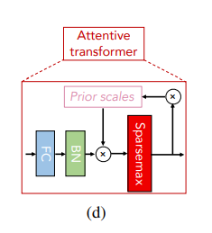

# TabNet_tf

My implementation of TabNet: Attentive Interpretable Tabular Learning  from Sercan O Arik and Tomas Pfister (https://arxiv.org/pdf/1908.07442.pdf) with tensorflow.

Video from Sercan: https://www.youtube.com/watch?v=tQuIcLDO5iE

https://medium.com/deeplearningmadeeasy/sparsemax-from-paper-to-code-351e9b26647b

## Attentive Transformer

- Learnable mask: $\mathbf{M[i]} \in \Re ^ {B \times D}$

- $\mathbf{P[i]} = \prod\nolimits_{j=1}^{i} (\gamma - \mathbf{M[j]})$ where $\gamma$ is a relaxation parameter
- $
\mathbf{M[i]} = \text{sparsemax}(\mathbf{P[i-1]} \cdot \text{h}_i(\mathbf{a[i-1]})).
$
- $\sum\nolimits_{j=1}^{D} \mathbf{M[i]_{b,j}} = 1$

- $L_{sparse} = \sum\nolimits_{i=1}^{N_{steps}} \sum\nolimits_{b=1}^{B} \sum\nolimits_{j=1}^{D} \frac{-\mathbf{M_{b,j}[i]} \log(\mathbf{M_{b,j}[i]} \! +\!  \epsilon)}{N_{steps} \cdot B},$

## Feature processing

From the original paper, the feature transformation is given by:

$[\mathbf{d[i]}, \mathbf{a[i]}] = \text{f}_i(\mathbf{M[i]} \odot \mathbf{f})$

where:
- $B$ denotes the batch size.
- $D$ represents the number of features.
- $\mathbf{f} \in \Re ^ {B \times D}$ is the matrix of input features.
- $\mathbf{M[i]} \in \Re ^ {B \times D}$ is the learnable mask applied to the features.
- $\mathbf{d[i]} \in \Re ^ {B \times N_d}$ and $\mathbf{a[i]} \in \Re ^ {B \times N_a}$ are the outputs of the transformation.

Following this:
- $\mathbf{M[i]} \odot \mathbf{f}$ is an element-wise multiplication so the result is of shape $(B, D)$
- Consequently, $[\mathbf{d[i]}, \mathbf{a[i]}]$ possesses a shape of $(B, N_a + N_d)$

The function $\text{f}_i$ is the learnable transformation which includes fully connected (FC) layers. Each FC layer should have $N_a + N_d$ neurons.The resulting matrix is then split with the first $N_d$ rows directed to $d[i]$ and the remaining $N_a$ rows directed to $a[i]$.

***Note on the $\sqrt{0.5}$***

Residual connections in neural networks involve adding the output of one layer to the output of one or more previous layers. This can be beneficial in deep architectures to mitigate the vanishing gradient problem and improve convergence.

When performing an element-wise addition of two tensors, the variance of the output can increase. To understand why, consider:

Let $X$ and $Y$ be two independent random variables with the same variance $\sigma^2$. The variance of their sum is:

$\text{Var}(X + Y) = 2 \times \sigma^2$

To keep the variance of the sum consistent with $\sigma^2$, we would divide the sum by $\sqrt{2}$:

$\text{Var} \left( \frac{X + Y}{\sqrt{2}} \right) = \sigma^2$

This reasoning underpins the division by $\sqrt{2}$ (= multiply by $\sqrt{0.5}$) after adding residual connections. It aims to stabilize variance across layers.

Reference: Gehring, J.; Auli, M.; Grangier, D.; Yarats, D.; and Dauphin,
Y. N. 2017. Convolutional Sequence to Sequence Learning.
arXiv:1705.03122 .

## Utils

### Gated Linear Unit

**Reference**: Dauphin, Y. N., Fan, A., Auli, M., & Grangier, D. (2017). Language Modeling with Gated Convolutional Networks. Proceedings of the 34th International Conference on Machine Learning - Volume 70, ICML'17, 933–941. ([arXiv](https://arxiv.org/pdf/1612.08083.pdf)).

The Gated Linear Unit (GLU) activation function is employed in TabNet. The authors observed an empirical advantage of using GLU over conventional nonlinearities like ReLU.

What I believe: GLUs offer a more refined modulation of information flowing through the network, allowing for a nuanced blend of features, in contrast to the more binary behavior of ReLU (either activated or not). This nuanced control might provide TabNet with enhanced flexibility and performance in handling diverse feature interactions

$\text{GLU}(x) = x \odot \sigma(Wx + b)$

where:
- $x$ is the input
- $\sigma$ is the sigmoid function
- $W$ is the weight matrix
- $b$ the bias vector

In TabNet, the linear transformation is handled by the FC layer. Thus, my implementation of GLU will focus on the sigmoid activation and the element-wise multiplication.

### Ghost BatchNormalization

**References**: 
- Hoffer, E.; Hubara, I.; and Soudry, D. 2017. Train longer, generalize better: closing the generalization gap in large batch training of neural networks. ([arXiv:1705.08741](https://arxiv.org/pdf/1705.08741.pdf)).
- Neofytos Dimitriou, Ognjen Arandjelovic (2020). A New Look at Ghost Normalization. ([arXiv:2007.08554](https://arxiv.org/pdf/2007.08554.pdf)).

Ghost Batch Normalization (GBN) is a variation of the conventional Batch Normalization (BN) technique. While BN computes normalization statistics (mean and variance) over the entire batch, GBN calculates these statistics over "ghost batches". These ghost batches are subpartitions of the original batch.

Let's consider a full batch $B$ divided into $k$ ghost batches $B_1, B_2, ..., B_k$.

For a specific ghost batch $B_j$, the normalization procedure is as follows:

- Mean

$\mu_{B_j} = \frac{1}{m} \sum_{i=1}^{m} x_i$

where $m$ is the size of the ghost batch $B_j$ and $x_i$ are the inputs within $B_j$.

- Variance
  
$\sigma_{B_j}^2 = \frac{1}{m} \sum_{i=1}^{m} (x_i - \mu_{B_j})^2$

- Normalization

$\hat{x_i} = \frac{x_i - \mu_{B_j}}{\sqrt{\sigma_{B_j}^2 + \epsilon}}$

where $\epsilon$ is a small number to prevent division by zero.

- Scaling and shift

$y_i = \gamma \hat{x_i} + \beta$

where $\gamma$ and $\beta$ are learnable parameters of the model.

This methodology is applied to each ghost batch $B_j$. So, rather than applying statistics over the entire batch, GBN uses the statistics specific to the corresponding ghost batch for each subset of inputs.

--------------------
TODO:
- écrire un test unitaire pour vérifier que chaque ligne d'un masque = 1
- Ajouter doc dans README.md pour sparsemax
- Implementer L_sparse
- finir la doc mathématique de README
- Réfléchir à la prise en charge du dernier batch dans FeatureTransformer/ GBN... => J'ai retiré tout contrôle de la taille de virtual batch size vs batch size
  - pour l'instant on met un "drop_remainder":

The most appropriate solution depends on the specifics of your use case and the importance of every data point in your training set. Here are the pros and cons of the potential solutions:

Adjust the Batch Size:

Pros: Ensures all data is used for training.
Cons: Might not be optimal for model convergence or GPU memory utilization.
Drop the Last Batch:

Pros: Quick and easy solution. Ensures that all batches are of the same size, which can be beneficial for certain optimization algorithms and GPU memory utilization.
Cons: You lose a small portion of your training data. If your dataset is already small, this might not be ideal.
Adjust the Virtual Batch Size:

Pros: Allows you to use smaller actual batch sizes while still benefiting from the regularization effect of a larger virtual batch size.
Cons: Might reduce the regularization effect of Ghost Batch Normalization if set too low.
Pad the Last Batch:

Pros: Ensures all data is used for training.
Cons: Introduces artificial data points which might affect training dynamics. Requires a mechanism to ignore these points during loss computation.
Given these options:

If every data point is crucial and you cannot afford to lose any, consider adjusting the batch size or padding the last batch.

If you're using Ghost Batch Normalization primarily for its regularization effect and not for computational reasons, consider adjusting the virtual batch size.

If you have a large dataset and losing a few data points from the last batch isn't a big concern, dropping the last batch is the simplest solution.

For many practical scenarios with large datasets, dropping the last batch is a common approach because the potential negative impact on model performance is minimal. However, if your dataset is small or if every data point is crucial, you might want to consider one of the other options."